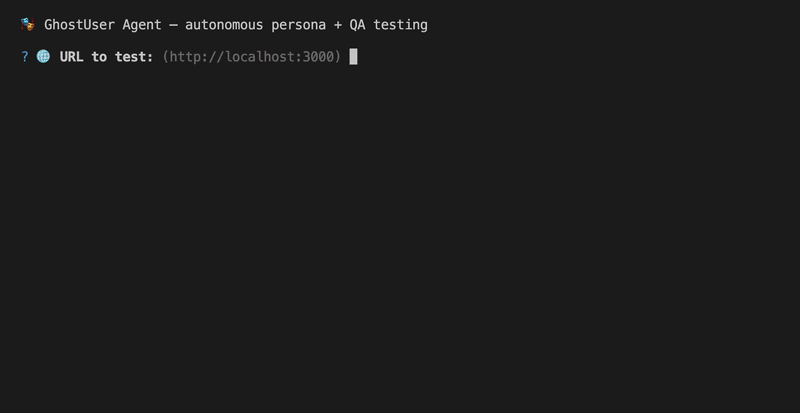

# GhostUser

> **AI personas that test your UX before real users do.**

Built something? You're too deep in it to see what's confusing anymore. Real user testing costs €40k and takes weeks. Friends say *"looks great"* and don't sign up. ChatGPT tells you it's fine.

GhostUser gives you five fake users with no ego — Maya the Newbie, Dan the Buyer, Riley the Power User, Sam the Skeptic, Alex In-A-Hurry — who walk through your product and tell you stuff like:

- 💬 *"I tried to click that label because I thought it was a button. It wasn't. I gave up."*
- 💬 *"I scrolled looking for 'Forgot password' — nowhere. Closing the tab."*
- 💬 *"Cmd+K? Nothing happened. This isn't for power users."*

While they walk, GhostUser also catches **broken features** — console errors, failed requests, 5xx responses — like a QA tester running alongside.

Open source. You bring your own Anthropic API key. Costs cents per test.



*Example of `ghostuser-agent` — persona opens your dev server, clicks around, and reports what's broken or confusing.*

---

## 🤔 Which option is for me?

| You are | Pick |
|---|---|
| 🎨 A designer working in Figma | **Figma plugin** |
| 🧑‍💻 A developer with a localhost dev server | **CLI agent** |
| 🤖 Someone using Claude Desktop / Claude Code / Cursor / Windsurf | **MCP server** |

You can install all three. Same engine underneath.

---

## 🎨 Figma plugin (for designers)

Test designs directly in Figma — no terminal, no setup.

**One-time install:**

```bash
git clone https://github.com/savkevip/ghostuser.git
cd ghostuser
npm install
npm run build
```

Then in **Figma Desktop**:
1. Menu → **Plugins → Development → Import plugin from manifest…**
2. Pick `packages/figma/dist/manifest.json`.

**Use it:**
1. Select 1+ frames in Figma.
2. Menu → **Plugins → Development → GhostUser**.
3. First time: paste your Anthropic API key ([get one here](https://console.anthropic.com)).
4. Pick a persona, type a goal (e.g. *"Sign up for the product"*), hit **Run**.
5. Each frame gets a chain-of-thought reaction + UX bugs.

Your API key lives only inside Figma's local storage. Nothing else leaves your machine.

---

## 🧑‍💻 CLI agent (for developers)

Test a live localhost dev server end-to-end. The agent opens a real browser and a persona clicks through it.

```bash
git clone https://github.com/savkevip/ghostuser.git
cd ghostuser
npm install
npm run build
cp .env.example .env       # then paste your sk-ant-... key into .env
npx playwright install chromium
npm run agent
```

The CLI asks you, step by step: URL, goal, model, persona(s), browser visibility. Chromium opens, persona navigates, you watch.

When done you get:
- ✅/❌/🚫 verdict
- 🎨 UX bugs (persona's confusion)
- 🐛 QA bugs (broken features, console errors, HTTP 5xx)
- 💰 Real cost charged

> ⚠️ **Localhost only.** Cloudflare / reCAPTCHA will block the agent on production URLs (we don't bypass bot protection — that's intentional).

---

## 🤖 MCP server (for Claude Desktop / Claude Code / Cursor / Windsurf)

Talk to Claude normally — "test the signup flow at http://localhost:3000" — and Claude runs the test using GhostUser.

**One-time setup:**

```bash
git clone https://github.com/savkevip/ghostuser.git
cd ghostuser
npm install
npm run build
```

Then register the MCP server with your AI client:

<details>
<summary><strong>Claude Desktop</strong></summary>

Edit `~/Library/Application Support/Claude/claude_desktop_config.json` (create if missing):

```json
{
  "mcpServers": {
    "ghostuser": {
      "command": "node",
      "args": ["/ABSOLUTE/PATH/TO/ghostuser/packages/mcp/dist/index.js"],
      "env": { "ANTHROPIC_API_KEY": "sk-ant-..." }
    }
  }
}
```

Restart Claude Desktop. You'll see a 🔌 icon — GhostUser tools are available.

</details>

<details>
<summary><strong>Claude Code</strong></summary>

```bash
claude mcp add ghostuser node /ABSOLUTE/PATH/TO/ghostuser/packages/mcp/dist/index.js
```

Then `export ANTHROPIC_API_KEY=sk-ant-...` in your shell.

</details>

**Use it:** open any chat and say *"Hoću da testiram UX svog sajta sa GhostUser-om."* Claude walks you through every question (URL, goal, persona, cost preview) before running the test.

---

## 🎭 Personas

| Persona | Description |
|---|---|
| 👶 **Maya the Newbie** | First-time user, 27, marketing coordinator. Low patience. Confused by jargon. |
| 💼 **Dan the Buyer** | 42, head of ops at a startup. Skeptical. Wants pricing + proof. |
| ⚡ **Riley the Power User** | 31, senior engineer. Uses 20+ tools. Expects keyboard shortcuts. |
| 🤨 **Sam the Skeptic** | 38, freelance designer. Burned by 20+ SaaS subs. |
| 🏃 **Alex In-A-Hurry** | 29, PM browsing on phone between meetings. 60 seconds tops. |

Want a custom persona (e.g. *"a fintech compliance officer"*)? The CLI's *"+ Create new persona"* option and the MCP `create_persona` tool let you define one. Saved to `~/.ghostuser/personas.json`.

---

## 📋 Custom evaluation rules (optional)

Want GhostUser to ALWAYS check specific things — accessibility, brand voice, industry compliance — on every test? Write rules in markdown:

```bash
npm run criteria         # opens ~/.ghostuser/criteria.md in your editor
npm run criteria -- show # prints current content
```

Example:

```markdown
# Accessibility (WCAG AA)
- All images must have meaningful alt text
- Text contrast must meet 4.5:1 ratio

# Brand voice
- Never say "users" — always "customers"
- CTAs must use action verbs ("Get started", not "Click here")
```

Every persona will check against these on every test.

---

## 💰 Cost

Pay-as-you-go via your own Anthropic key. Typical per-test cost (Sonnet 4.6):

- Single screenshot test: **~$0.02**
- Full agent run (5–15 steps): **~$0.10 – $0.25**

Haiku ~5× cheaper. Opus ~5× more expensive. The real cost is shown after every test, never an estimate.

---

## 📦 Packages (for the curious)

| Package | What it is |
|---|---|
| [`ghostuser-core`](./packages/core) | Persona library + single-screenshot simulator |
| [`ghostuser-agent`](./packages/agent) | Playwright + Claude vision agent for live sites |
| [`ghostuser-mcp`](./packages/mcp) | MCP server (7 tools) for Claude Desktop / Code / Cursor / Windsurf |
| [`ghostuser-figma`](./packages/figma) | Figma plugin |

Same engine, four surfaces.

---

## ❤️ Sponsor

GhostUser is open source and free.

- ☕ [buymeacoffee.com/savkevipg](https://buymeacoffee.com/savkevipg)
- 🌟 Star the repo

---

## 🤝 Contributing

This is an indie maker side project. PRs welcome — no SLA on response time. Open an issue first if you're proposing big changes.

Built with ❤️ by [Miloš Savić](https://github.com/savkevip).

---

## 📜 License

[MIT](./LICENSE) — do whatever you want with it.
